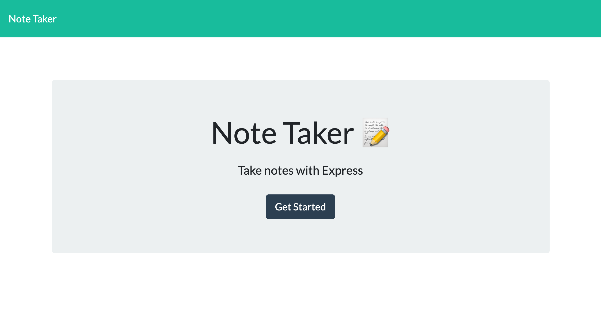
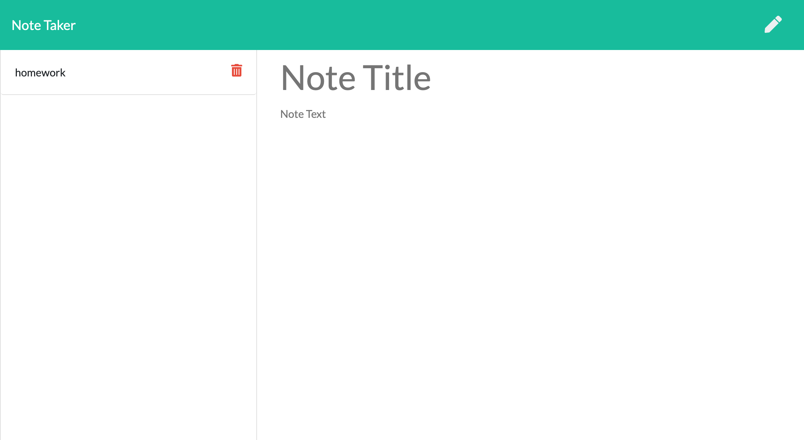
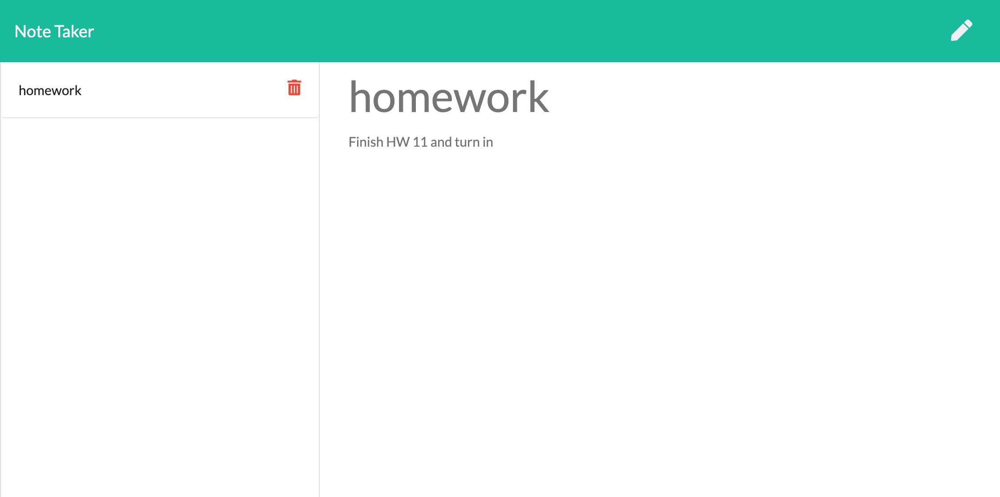

# Note-Taker

## Table of Contents

- [Description](#Description)
- [Technologies Used](#Technologies-used)
- [User Story](#User-Story)
- [Acceptance Criteria](#Acceptance-Criteria)
- [Images](#Images)
- [Links](#Links)

  # Description

  This is a simple note taker application. Easily add important notes and delete when your task is completed!
  You are are able to view and delete notes in the side bar.

  # Technologies Used

  Express

  JavaScript

  # User Story

  AS A user, I want to be able to write and save notes

  I WANT to be able to delete notes I've written before

  SO THAT I can organize my thoughts and keep track of tasks I need to complete

  # Acceptance Criteria

  Application should allow users to create and save notes.

  Application should allow users to view previously saved notes.

  Application should allow users to delete previously saved notes.

  # Images

  
  
  